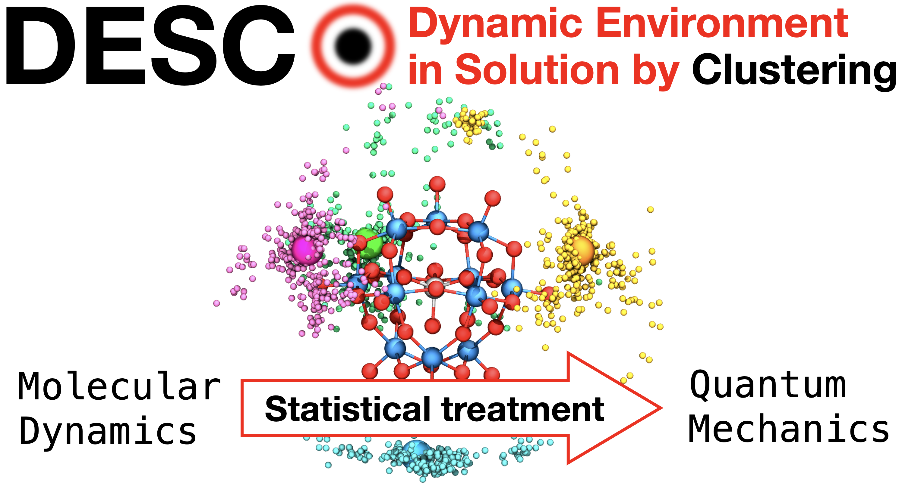
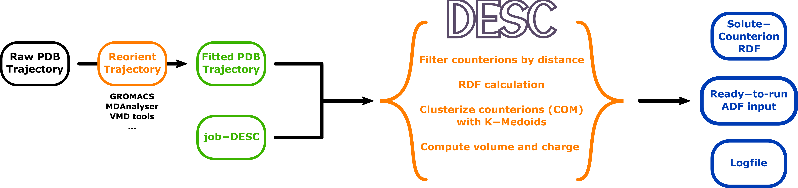

<div style="text-align: center;">
  
</div>

# DESC: Dynamic Environment in Solution by Clustering

- [Introduction](#Introduction)
- [Installation](#Installation)
- [Quickstart](#Quickstart)
- [Usage](#Usage)
- [How to Cite](#Howtocite)
- [License and Copyright Information](#licenseandcopyrightinformation) 
- [Support and Contact](#supportandcontact)

## Introduction
The properties and dynamic behavior of molecules in solution are influenced by the solvent and electrolytes, particularly when aggregation with the solute occurs. While implicit solvent models (ISMs) in DFT calculations describe the electronic structure well, they cannot differentiate between effects of different cations, leading to unaccounted variations in solute properties. Adding explicit counterions in QM calculations addresses this but introduces challenges: defining representative positions, numerical convergence issues, long computational times for bulky ions, and the need for multiple replicas.

We propose DESC, an automated strategy that incorporates detailed counterion effects from classical Molecular Dynamics (MD) data into QM calculations. DESC enhances ISMs by accurately accounting for environmental variability and is especially useful for systems with significant aggregation and physicochemical changes due to counterions. DESC yields chemically representative QM results at a fraction of the computational cost compared to explicit counterions.

**Authors**: Albert Masip-Sánchez<sup>a</sup>, Xavier López<sup>a</sup>, Josep M. Poblet<sup>a</sup>

<small><sup>a</sup> Quantum Chemistry Group, Physical and Inorganic Chemistry Department, Universitat Rovira i Virgili - Tarragona - Spain</small>

**Developer(s)**: Albert Masip-Sánchez

## Installation
DESC can be installed via git and pip by executing the following commands:
```
git clone https://github.com/qcgurv/DESC.git
cd DESC
git checkout v1.0.0
pip install -e .
```

## Quickstart
The computational strategy employed by DESC has been implemented in a Python code that, given a trajectory in PDB format and a very simple [input file](docs/job-DESC) with information about the system, can analyze the molecular dynamics simulation and generate an ADF input file ready to be submitted, thereby incorporating the effects of the aggregated ions on the solute. It is a model of general application, with no restrictions in terms of molecular charge, nature or number of the constituent molecules, or solvent nature. The use of ADF software is not restrictive; the concepts behind DESC are broadly applicable to any other computational software. However, the integration with other programs remains to be addressed in subsequent versions of DESC.

The most novel aspect of DESC is that, in order to account counterion effects, it introduces them through:
1. a cloud of point charges positioned at the locations of the counterions aggregated during the MD simulation, and
2. a set of ghost atoms with explicit spherical volume that simulate the presence of cations around a solute, placed at the most representative positions of the counterions.

With the correct selection of radius and charge, the model can capture the effects present in a calculation with explicit counterions without double counting their effect on the ISM. While COSMO already introduces the average effect of counterions in an implicit bulk, the introduction of ghost atoms with volume, which prevent the ISM from reaching the solute in certain regions, and surrounding it with an adjusted charge distribution, reproduces the local effects of explicit counterions.

Before DESC is used, it is crucial that the solute of interest maintains the same orientation (both rotationally and translationally) throughout the entire trajectory. This ensures that all frames processed by DESC are equivalent and comparable, as well as confirming that the ionic atmosphere around the solute is accurately reproduced. Trajectories can be easily converted using specific software such as [GROMACS](https://manual.gromacs.org/current/onlinehelp/gmx-trjconv.html), Python libraries like [MDAnalysis](https://docs.mdanalysis.org/1.0.1/documentation_pages/transformations/fit.html), or scripts for [VMD](scripts/trjfitting.tcl). What these algorithms do is use a frame from the molecular dynamics simulation as a reference and reduce the root-mean-square deviation (RMSD) between the frames, keeping one residue fixed (in this case).



More information about DESC can be found in the [PhD thesis](https://www.tesisenred.net/handle/10803/692316?show=full) of the author.

## Usage
Once installed successfully, DESC only requires the trajectory in PDB format and the job-DESC input file. Execute it as follows:

```
python -m desc.main job-DESC
```

Make sure that job-DESC correctly references the trajectory filename!

## How to cite
If you employ DESC and publish findings derived from this method, we kindly request that you cite the original publication:

> Masip-Sánchez, A., Poblet, J.M., López, X., *Journal of Chemical Theory and Computation*, **2025**, DOI: [10.1021/acs.jctc.5c00002](10.1021/acs.jctc.5c00002).

## Support and Contact
In case you should encounter problems or bugs, please write a short message to albert.masip@urv.cat.
