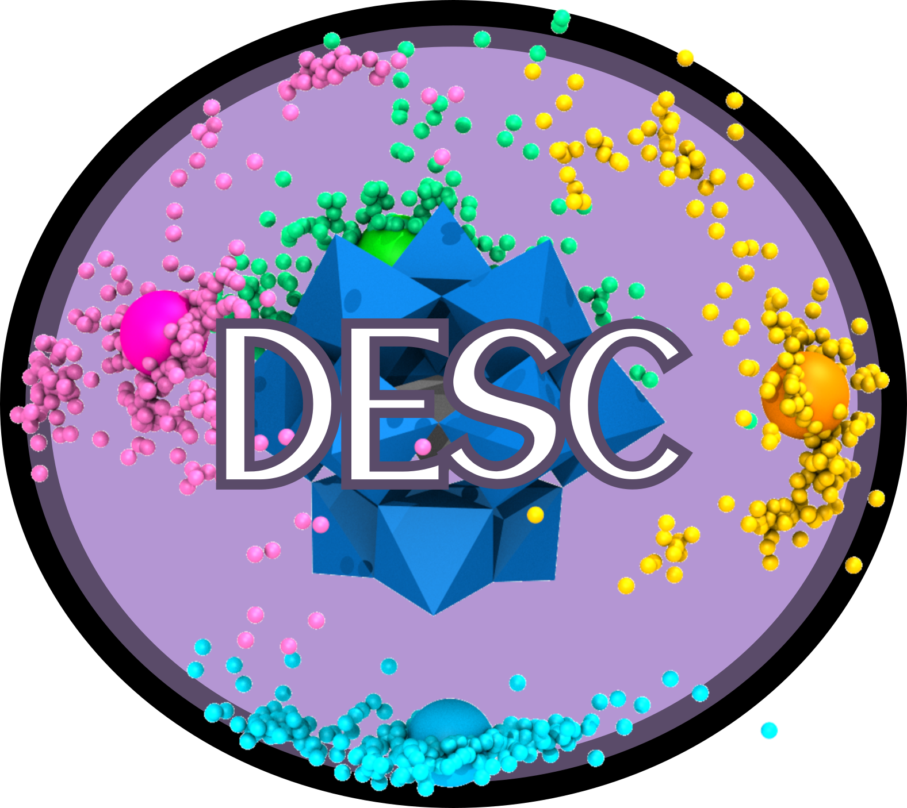

  

# DESC: Dynamic Environment in Solution by Clustering

- [Introduction](#Introduction)
- [Installation](#Installation)
- [Quickstart](#Quickstart)
- [How to Cite](#Howtocite)
- [License and Copyright Information](#licenseandcopyrightinformation) 
- [Support and Contact](#supportandcontact)

## Introduction
The properties and dynamic behavior of molecules in solution are influenced by the solvent and electrolytes, particularly when aggregation with the solute occurs. While implicit solvent models (ISMs) in DFT calculations describe the electronic structure well, they cannot differentiate between effects of different cations, leading to unaccounted variations in solute properties. Adding explicit counterions in QM calculations addresses this but introduces challenges: defining representative positions, numerical convergence issues, long computational times for bulky ions, and the need for multiple replicas.

We propose DESC, an automated strategy that incorporates detailed counterion effects from classical Molecular Dynamics (MD) data into QM calculations. DESC enhances ISMs by accurately accounting for environmental variability and is especially useful for systems with significant aggregation and physicochemical changes due to counterions. DESC yields chemically representative QM results at a fraction of the computational cost compared to explicit counterions.

**Authors**: <u>Albert Masip-Sánchez</u>a, Xavier Lópeza, Josep M. Pobleta

<small>a Quantum Chemistry Group, Physical and Inorganic Chemistry Department, Universitat Rovira i Virgili - Tarragona - Spain</small>

## Installation

## Quickstart

 

## How to cite

## License and Copyright Information

## Support and Contact
